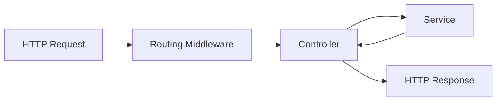

<p align="center"><a href="https://laravel.com" target="_blank"></a></p>

<p align="center">
<a href="https://github.com/laravel/framework/actions"></a>
<a href="https://packagist.org/packages/laravel/framework"></a>
<a href="https://packagist.org/packages/laravel/framework"></a>
<a href="https://packagist.org/packages/laravel/framework"></a>
</p>

## 🚀 starting

These instructions will allow you to get a copy of the project running on your local machine for development and testing purposes.

### 📋 Prerequisites

What things do you need to install the software and how do you install it?

|Technologies    |PHP                            |Composer                     |
|----------------|-------------------------------|-----------------------------|
|Version         |`^8.1`                        |`2.6.6`                      |

### 🔧 Installation
1. Clone the repository:
```
git clone https://github.com/JosePedro-22/Backend-Challenge.git
```
2. Navigate to the project directory:
```
cd Backend-Challenge
```
3. Install dependencies:
```
composer install
```
5. Create the seed:
```
php artisan db:seed --class=NewsSeeder
```
6. starting project:
```
php artisan serve
```
7. Clone the repository:
```
git clone https://github.com/JosePedro-22/Frontend-Challenge.git
```
8. Navigate to the project directory:
```
cd Frontend-Challenge
```
9. starting project:
```
http-server
```


## ⚙️ Running the tests

To run test

```
php artisan test
```

### 🔩 Unitary tests (Unit Tests):

To run the test, run the command

```
php artisan test tests/Unit/app/Domain/News/Service/NewsServiceTest.php
```

### 🔩 End-to-End Tests (Feature Tests):

To run the test, run the command

```
php artisan test tests/Feature/app/Domain/News/Service/NewsServiceTest.php
```

## 🎲 The main technical decisions I made: 

* Language and Framework: Laravel is a popular choice for developing PHP web applications due to its elegant syntax and comprehensive feature set. Furthermore, the PHP language is widely used and has a large community of developers and resources available.
* Architecture: We chose to apply the principle of Domain-Driven Design (DDD) to organize the code into distinct layers. This helps maintain a clear separation of responsibilities and facilitates application maintenance and scalability.
* Tests: Unit tests and end-to-end tests were implemented to ensure code quality and correct application functionality. Testing helps identify and fix problems earlier in the development cycle.
* API Output: Using the Eloquent's resource class allows you to expressively and easily transform your models and model collections into JSON.

## 💬 comments about the project:
#### Diagrams of the path from request to response


## 🎲 Other
|Name Branch     |Description                                                  |
|----------------|-------------------------------------------------------------|
|main            |base project|
|feat/list-materials            |develop project|

## 🛠️ Building with

* [Laravel](https://laravel.com/) - The web framework used
* [Composer](https://getcomposer.org/) - Dependency Manager

## ✒️ Authors

* **José Pedro** - *Development / Documentation* - [Developer](https://www.linkedin.com/in/josepedro-sm/)


## License

The Laravel framework is open-sourced software licensed under the [MIT license](https://opensource.org/licenses/MIT).
